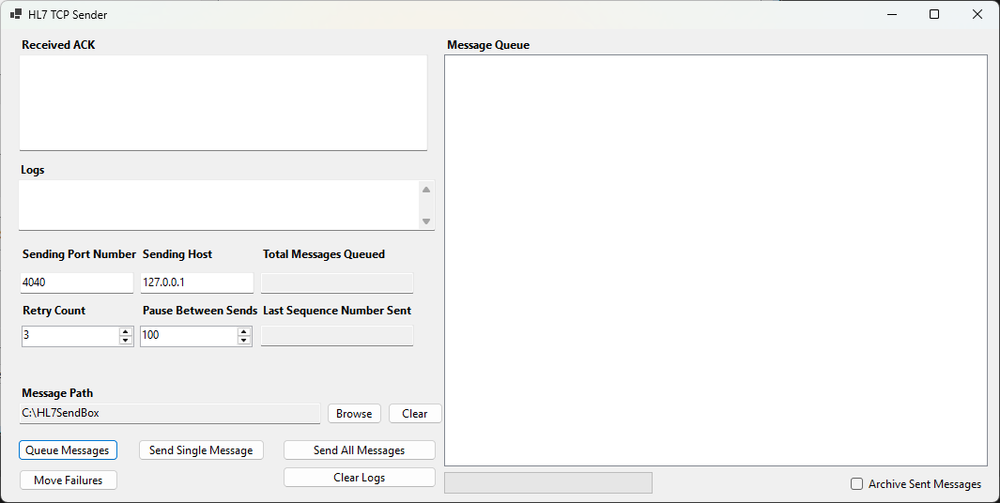

# HL7 TCP Sender

HL7 TCP Sender is a lightweight Windows Forms utility for sending HL7 messages over TCP/IP using the MLLP (Minimal Lower Layer Protocol) framing standard.
It’s designed for testing, simulation, or manual dispatch of HL7 messages to an integration engine or receiving system.

## Built with:

- NHapi for robust HL7 parsing
- Async TCP for responsive network operations
- Parallel file queueing for speed
- Live progress tracking and message archiving options

Basically, it’s your friendly little HL7 launch console.

### Preview



# Features

✅ Queue messages from a folder

- Automatically detects all `.hl7` files
- Extracts message control IDs (`MSH-10`) using NHapi’s `Terser` parser
- Sorts by sequence for correct send order

✅ Send individually or in bulk

- Send all queued messages in sequence
- Or send just one with the "Send Single" button

✅ Reliable MLLP sending

- Start Block / End Block / Carriage Return wrapping
- Waits for ACK response (with retries)
- Handles timeout and network exceptions gracefully

✅ Automatic cleanup

- Choose between archiving sent messages or deleting them
- Failed messages automatically move to a "Failed" folder

✅ Progress & logs

- Live progress bar with "X / Y sent" tracking
- Logs every connection, ACK, and file operation
- Displays decoded ACK message in real time

✅ Smart configuration

- `appsettings.json` stores your host, port, delay, and retry preferences
- Automatically loads and saves on exit

✅ NHapi-powered

- Real HL7 parsing (no "split by pipe and pray")
- Accurate sequence ID extraction from MSH-10
- Compatible with HL7 v2.1–v2.8 messages

# How It Works

1. Select your HL7 folder (the app looks for `*.hl7` files).
2. Click Queue Messages — the app scans, extracts sequence numbers, and populates the list.
3. Hit Send All or Send Single.
4. Watch the progress bar and message list update live as each file is sent.
5. Successful messages are deleted or archived automatically.

# Configuration

All settings are saved to `appsettings.json` in the same folder as the executable:

```json
{
  "SendingHost": "127.0.0.1",
  "Port": 4040,
  "FolderPath": "C:\\HL7\\ToSend",
  "DelayMs": 100,
  "MaxRetries": 3
}
```
You can edit this file manually or let the application manage it automatically.

# Requirements

- Windows 10 or later
- .NET 8.0+ runtime
- Network access to target host/port